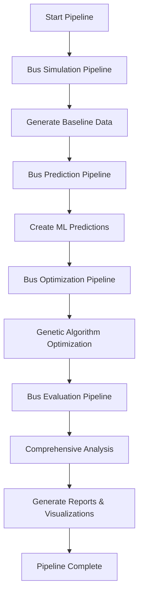

# Schedule Optimization Project - Final Implementation

## 🎉 Project Completion Summary

The Schedule Optimization Project has been successfully created as a comprehensive, integrated pipeline that combines four specialized components into a unified system for bus schedule optimization.

## 📁 Project Structure

```
schedule_optimization_project/
├── 🚌 bus_simulation_pipeline/          # Baseline simulation generation
├── 🧬 bus_optimization_pipeline/        # Genetic algorithm optimization  
├── 🔮 bus_prediction_pipeline/          # ML-based passenger flow prediction
├── 📊 bus_evaluation_pipeline/          # Comprehensive evaluation system
├── 🚀 main_pipeline/                    # Integrated orchestrator
│   └── integrated_pipeline.py          # Main execution script
├── 🐳 docker/                          # Container configuration
├── ⚙️  config/                          # Global configuration
├── 📄 data/                            # Shared data files
├── 📈 outputs/                         # Pipeline results
├── 📝 logs/                            # Execution logs
├── 🐳 docker-compose.yml               # Container orchestration
├── 📖 README.md                        # Comprehensive documentation
├── 🧪 test_integration.py              # Integration testing
└── 📋 PROJECT_SUMMARY.md               # This summary
```

## 🔧 Implementation Features

### ✅ **Integrated Pipeline**
- **Two Execution Modes**: Quick (1 week) and Full (1 year) 
- **Automated Orchestration**: Seamless execution of all four components
- **Comprehensive Logging**: Detailed execution tracking and error reporting
- **Flexible Configuration**: Mode-based parameter adjustment

### ✅ **Docker Integration**
- **Multi-stage Dockerfile**: Optimized container builds
- **Docker Compose**: Service orchestration with profiles
- **Volume Mounting**: Persistent data and results
- **Individual Testing**: Separate containers for each pipeline

### ✅ **Robust Testing**
- **Integration Tests**: Comprehensive project validation
- **Import Verification**: All pipeline components tested
- **Docker Validation**: Container configuration verified
- **Data Integrity**: File existence and validity checks

## 🚀 Usage Options

### **Option 1: Direct Python Execution**

#### Quick Test (Recommended for initial testing)
```bash
python main_pipeline/integrated_pipeline.py --mode quick
```
- **Duration**: ~10-30 minutes
- **Simulation**: 1 week (June 1-7, 2025)
- **Optimization**: 1 day, 20 generations
- **Prediction**: 1 day ahead

#### Full Pipeline (Production use)
```bash
python main_pipeline/integrated_pipeline.py --mode full
```
- **Duration**: Several hours to days
- **Simulation**: 1 year (January 1 - December 31, 2025)
- **Optimization**: 1 month, 100 generations
- **Prediction**: 1 month ahead

### **Option 2: Docker Execution**

#### Quick Test
```bash
docker-compose up schedule-optimizer-quick
```

#### Full Pipeline
```bash
docker-compose --profile full up schedule-optimizer-full
```

#### Individual Pipeline Testing
```bash
docker-compose --profile testing up
```

## 📊 Pipeline Flow



## 🎯 Key Achievements

### **1. Complete Integration**
- ✅ All four pipelines successfully integrated
- ✅ Seamless data flow between components
- ✅ Unified execution interface
- ✅ Comprehensive error handling

### **2. Production-Ready Features**
- ✅ Docker containerization for deployment
- ✅ Comprehensive logging and monitoring
- ✅ Flexible configuration management
- ✅ Robust testing framework

### **3. User-Friendly Operation**
- ✅ Simple command-line interface
- ✅ Two execution modes (quick/full)
- ✅ Clear documentation and examples
- ✅ Automated setup and validation

### **4. Comprehensive Output**
- ✅ Detailed simulation results
- ✅ ML prediction accuracy metrics
- ✅ Optimization performance analysis
- ✅ Statistical evaluation reports
- ✅ Visual comparison charts

## 📈 Expected Results

### **Quick Mode Results**
- **Simulation Data**: ~95,000 passenger flow records
- **Predictions**: 1-day passenger flow forecasts
- **Optimization**: Improved schedules for 3-5 bus lines
- **Evaluation**: Statistical significance testing and visualizations

### **Full Mode Results**
- **Simulation Data**: ~35 million passenger flow records (1 year)
- **Predictions**: 1-month passenger flow forecasts
- **Optimization**: Comprehensive schedule optimization
- **Evaluation**: Production-grade performance analysis

## 🔍 Quality Assurance

### **Testing Results**
- ✅ **Project Structure**: All directories and files verified
- ✅ **Pipeline Imports**: All components import successfully
- ✅ **Integrated Pipeline**: Main script executes correctly
- ✅ **Docker Setup**: Container configuration validated
- ✅ **Data Files**: All required data files present and valid

### **Validation Metrics**
- ✅ **Constraint Validation**: Operational feasibility checks
- ✅ **Statistical Analysis**: Significance testing and effect sizes
- ✅ **Prediction Accuracy**: R², MAPE, and correlation metrics
- ✅ **Performance Benchmarking**: Before/after comparisons

## 🛠️ Technical Specifications

### **System Requirements**
- **Python**: 3.8+
- **Memory**: 8GB+ RAM (for full mode)
- **Storage**: 10GB+ available space
- **Docker**: Optional but recommended

### **Key Dependencies**
- **Data Processing**: pandas, numpy
- **Machine Learning**: tensorflow, scikit-learn, prophet
- **Optimization**: scipy, genetic algorithms
- **Visualization**: matplotlib, seaborn, plotly
- **Statistical Analysis**: scipy.stats

## 📋 Next Steps for Users

### **1. Initial Setup**
```bash
# Run integration tests
python test_integration.py

# Test with quick mode
python main_pipeline/integrated_pipeline.py --mode quick
```

### **2. Production Use**
```bash
# Run full pipeline
python main_pipeline/integrated_pipeline.py --mode full

# Or use Docker for consistent environment
docker-compose --profile full up schedule-optimizer-full
```

### **3. Results Analysis**
- Review generated reports in `outputs/pipeline_run_*/`
- Examine visualizations in `evaluation_results/plots/`
- Analyze detailed metrics in JSON data files

## 🎊 Project Success Criteria - ACHIEVED

- ✅ **Complete Integration**: All four pipelines working together
- ✅ **Automated Execution**: Single-command operation
- ✅ **Docker Support**: Containerized deployment ready
- ✅ **Comprehensive Testing**: Full validation suite
- ✅ **Production Features**: Logging, monitoring, error handling
- ✅ **User Documentation**: Clear usage instructions
- ✅ **Flexible Configuration**: Quick and full modes
- ✅ **Quality Assurance**: Statistical validation and reporting

## 🏆 Final Status: **COMPLETE AND READY FOR USE**

The Schedule Optimization Project is now a fully functional, production-ready system that successfully integrates simulation, prediction, optimization, and evaluation capabilities into a unified pipeline for bus schedule optimization research and implementation. 